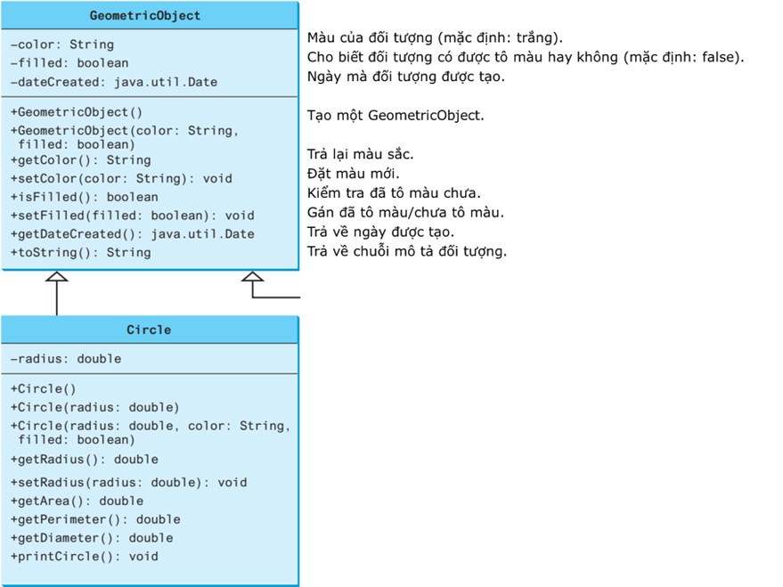

# Task 1: 
    Thiết kế một lớp có tên Person với các thuộc tính họ tên (name), (địa chỉ) address, số điện thoại (phoneNumber), và địa chỉ email (email).

    Student và Employee là hai lớp con của Person.

    Student có thêm thuộc tính trạng thái (status). Giá trị của status có thể rơi vào một trong 4 trường hợp sau: 1=freshman, 2=sophomore, 3=junior, 4= senior).

    Employee có thêm các thuộc tính: văn phòng (office), lương (salary), và ngày bắt đầu vào làm (startDate).

    Lecturer và Staff là các lớp con của Employee.

    Lecturer có thêm thuộc tính: số giờ hành chính (officeHours), chức danh (title)

    Staff có thêm thuộc tính cấp bậc (rank)

    Thực hiện các hàm tạo mặc định, hàm tạo có đối, các phương thức get/set để lấy/gán các dữ liệu trong tất cả các lớp.

    Ghi đè phương thức toString trong mỗi lớp để hiển thị thông tin của các đối tượng. Lưu ý, thuộc tính status hiển thị dưới dạng chuỗi “freshman”/ “sophomore”/ “junior”/ “senior” thay vì các số nguyên.

    Vẽ biểu đồ UML cho các lớp và triển khai chúng. Viết chương trình chính sử dụng các lớp.

# Task 2:
    Viết chương trình nhắc người dùng đọc hai số nguyên và hiển thị tổng của chúng. Chương trình của bạn sẽ nhắc người dùng đọc lại số nếu đầu vào không chính xác. (Gợi ý:sử dụng lớp ngoại lệ InputMismatchException)

# Task 3:
    Viết chương trình đáp ứng các yêu cầu sau:   Tạo một mảng với 100 số nguyên được chọn ngẫu nhiên. Nhắc người dùng nhập chỉ số của mảng, sau đó hiển thị giá trị phần tử tương ứng. Nếu chỉ mục được chỉ định nằm ngoài giới hạn, hiển thị thông báo "Ngoài giới hạn". (Gợi ý: sử dụng lớp ngoại lệ ArrayIndexOutOfBoundsException)

# Task 4:
    Định nghĩa lớp GeometricObject và lớp Circle trong biểu đồ UML dưới đây:

    Định nghĩa thêm các lớp sau, là các lớp con của lớp GeometricObject:
    Lớp Rectangle có hai trường dữ liệu width, height; các phương thức tương tự lớp Circle
    Lớp Square có trường dữ liệu side; các phương thức tương tự lớp Circle
    Lớp GeometricObject bổ sung thêm phương thức sumArea(GeometricObject[] a) để tính tổng diện tích của các hình.
    •	Viết chương trình chính:
        -	Tạo một mảng GeometricObject chứa 3 loại hình Circle, Rectangle, Square với dữ liệu từng hình cho trước
        -	Hiển thị tổng diện tích các hình trong mảng
        -	Hiển thị thông tin của từng hình trong mảng.
