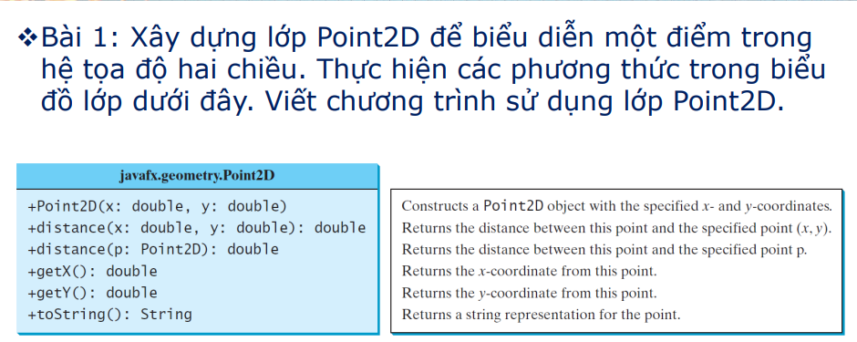
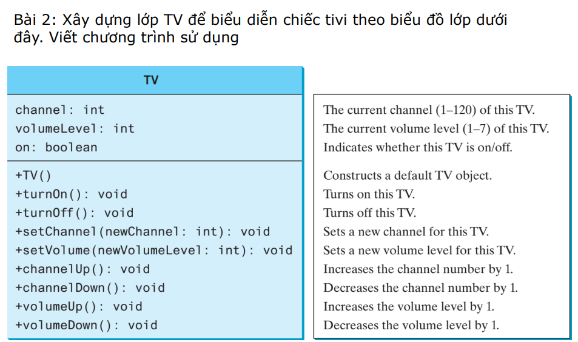

❖Bài 3: Viết chương trình cho một lớp Rectangle để biểu
diễn các hình chữ nhật
▪ Thuộc tính: width và height thuộc kiểu double
▪ Hàm tạo: hàm tạo mặc định, và hàm tạo có đối số để khởi tạo
đối tượng Rectangle với width và height được chỉ định
▪ Các phương thức get và set cho các thuộc tính
▪ Phương thức getArea() trả về diện tích hình chữ nhật
▪ Phương thức getPerimeter() trả về chu vi hình chữ nhật
▪ Viết chương trình sử dụng

❖ Bài 4: Sử dụng lớp java.util.Date để viết chương trình tạo
đối tượng Ngày. Lần lượt gán giá trị cho đối tượng đó bằng
10000, 100000, 1000000, 10000000, 100000000,
1000000000, 10000000000 và 100000000000, và hiển thị
ngày và giờ tương ứng bằng cách sử dụng phương thức
toString().
❖ Bài 5: Sử dụng lớp java.util.Random để viết chương trình
tạo một đối tượng Random với seed 1000 và hiển thị 50 số
nguyên ngẫu nhiên đầu tiên từ 0 đến 100 bằng phương
thức nextInt (100).

❖Bài 6: Định nghĩa một lớp với tên gọi Stopwatch, có:
▪ Thuộc tính startTime và endTime
▪ Các hàm thành viên để get và set các thuộc tính
▪ Hàm tạo không đối khởi tạo startTime bằng thời gian hiện tại
của máy tính
▪ Phương thức start() để đặt lại startTime về thời gian hiện tại
của máy tính
▪ Phương thức stop() để đặt endTime về thời gian hiện tại của
máy tính
▪ Phương thức getElapsedTime() trả về thời gian đã trôi qua với
đơn vị là milliseconds
▪ Viết chương trình sử dụng
