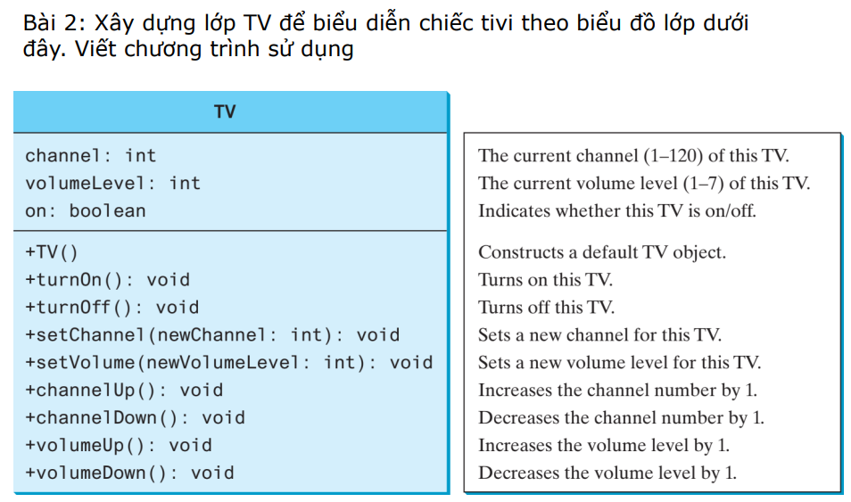

❖Bài 3: Viết chương trình cho một lớp Rectangle để biểu
diễn các hình chữ nhật
▪ Thuộc tính: width và height thuộc kiểu double
▪ Hàm tạo: hàm tạo mặc định, và hàm tạo có đối số để khởi tạo
đối tượng Rectangle với width và height được chỉ định
▪ Các phương thức get và set cho các thuộc tính
▪ Phương thức getArea() trả về diện tích hình chữ nhật
▪ Phương thức getPerimeter() trả về chu vi hình chữ nhật
▪ Viết chương trình sử dụng
❖Bài 3: Viết chương trình cho một lớp Rectangle để biểu
diễn các hình chữ nhật
▪ Thuộc tính: width và height thuộc kiểu double
▪ Hàm tạo: hàm tạo mặc định, và hàm tạo có đối số để khởi tạo
đối tượng Rectangle với width và height được chỉ định
▪ Các phương thức get và set cho các thuộc tính
▪ Phương thức getArea() trả về diện tích hình chữ nhật
▪ Phương thức getPerimeter() trả về chu vi hình chữ nhật
▪ Viết chương trình sử dụng
❖Bài 3: Viết chương trình cho một lớp Rectangle để biểu
diễn các hình chữ nhật
▪ Thuộc tính: width và height thuộc kiểu double
▪ Hàm tạo: hàm tạo mặc định, và hàm tạo có đối số để khởi tạo
đối tượng Rectangle với width và height được chỉ định
▪ Các phương thức get và set cho các thuộc tính
▪ Phương thức getArea() trả về diện tích hình chữ nhật
▪ Phương thức getPerimeter() trả về chu vi hình chữ nhật
▪ Viết chương trình sử dụng
